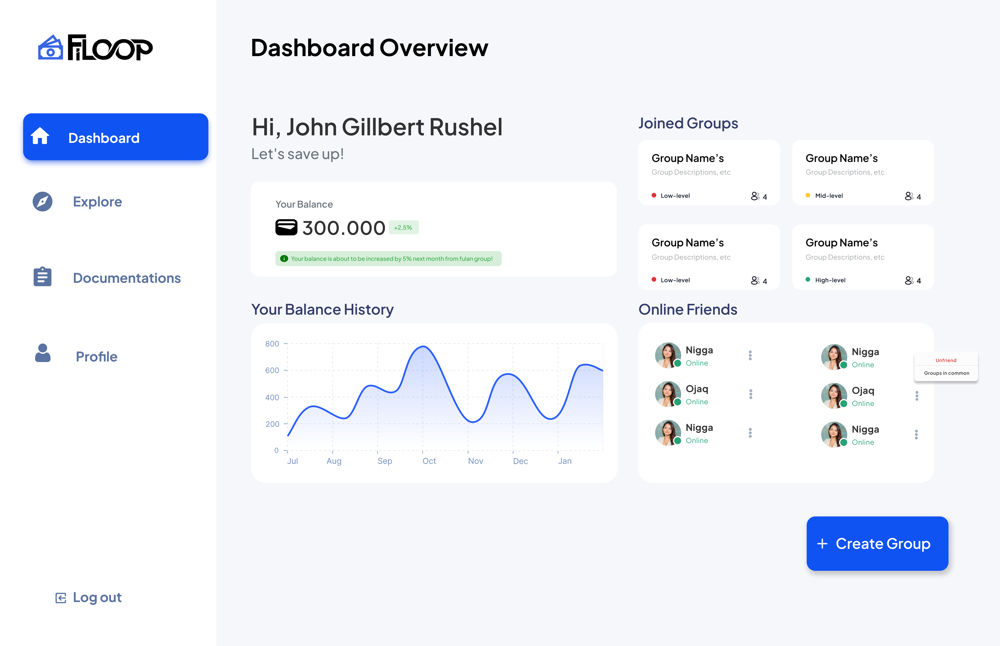

# SouSou - Backend



## Features (for now)
1. Register a user
5. Get current user
6. Login
7. Access token
8. Refresh tokens

## Project structure

```
$PROJECT_ROOT
├── config
├── prisma
│   └── schema.prisma
└── src
    ├── app.ts        # Entry point
    ├── controller
    ├── middleware
    ├── routes
    ├── schema
    ├── service
    └── utils
```

## Stack
- [TypeScript](https://www.typescriptlang.org/) - Static tye checking 
- [Express@5](https://expressjs.com/en/5x/api.html) - Web server
- [argon2](https://github.com/ranisalt/node-argon2#readme) - Password hashing
- [Zod](https://github.com/colinhacks/zod) - Validation
- [jsonwebtoken](https://github.com/auth0/node-jsonwebtoken) - Signing and verifying JSON web tokens
- [Nodemailer](https://nodemailer.com/about/) - Sending emails
- [Pino](https://github.com/pinojs/pino) - Logging
- [config](https://github.com/lorenwest/node-config) - Managing configuration


## Using
- [Postman](https://www.postman.com/downloads/)
- [Node.js](https://nodejs.org/en/)
- [Prisma](https://www.prisma.io/)
- [Swagger](https://www.swagger.io/)

## TODOs
- [X] Bootstrap application
- [ ] User API
    - [ ] Create user
    - [ ] Get current user
- [ ] Authentication API
    - [ ] Create user session
    - [ ] Get new access token with refresh tokens